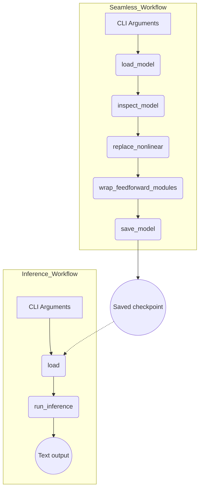

# Program Flow Overview

This document outlines how the main scripts and modules interact inside the project.

## High level

Two console entry points are provided by `pyproject.toml`:

- `gemcraft-seamless` – runs `gemcraft.seamless:main` to modify models.
- `gemcraft-inference` – runs `inference:main` to test inference with a model.

The diagram below summarises the key operations performed by these entry points.

### Steps

1. **load_model** – loads a Gemma model and tokenizer from Hugging Face and moves it to the selected device.
2. **inspect_model** – prints top level modules and parameter count.
3. **replace_nonlinear** – recursively swaps `GeGLU`, `RMSNorm`, and `QKNorm` layers for `nn.Identity` modules.
4. **wrap_feedforward_modules** – wraps feed‑forward blocks with `SeamlessWrapper`, padding if needed so wrapping can occur.
5. **save_model** – writes the modified weights and tokenizer to disk.
6. **load** – used by the inference script to load a saved or remote model.
7. **run_inference** – generates text from a prompt using the loaded model.

The `tests/` directory contains small unit tests validating tensor wrapping, feed‑forward detection, and that `replace_nonlinear` swaps modules correctly.
